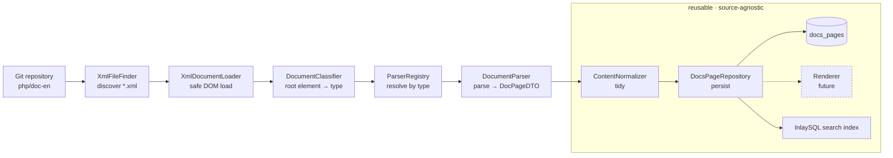
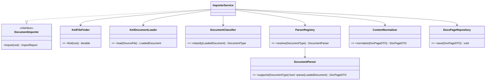
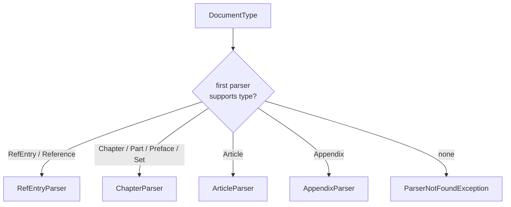
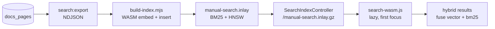

# Architecture

This document explains the documentation import pipeline layer-by-layer: what
each piece does, **why** the responsibilities are separated the way they are, and
how to extend it. All of it lives under [`app/Docs`](../app/Docs).

The guiding idea: this is a **documentation pipeline**, not a PHP importer. Only
one layer (the parser) knows about PHP/DocBook XML. Everything downstream of the
DTO is source-agnostic and reusable for Laravel, Symfony, MySQL, Docker, Redis,
or any other documentation set.

---

## 1. High-level flow



Everything left of the `DocumentParser` is XML-specific. Everything from
`DocPageDTO` onward is plain data — which is exactly why the reusable box can
grow (renderers, search, embeddings, AI summaries) without touching parsing.

---

## 2. Orchestration

[`ImporterService`](../app/Docs/Services/ImporterService.php) owns the control
flow and nothing else. It is injected with one collaborator per stage and never
touches XML, the DOM, or the database directly.

```mermaid
sequenceDiagram
    participant Imp as ImporterService
    participant Find as XmlFileFinder
    participant Load as XmlDocumentLoader
    participant Cls as DocumentClassifier
    participant Reg as ParserRegistry
    participant Par as DocumentParser
    participant Norm as ContentNormalizer
    participant Repo as DocsPageRepository

    Imp->>Find: find(root)
    loop each SourceFile
        Imp->>Load: load(file)
        Load-->>Imp: LoadedDocument
        Imp->>Cls: classify(document)
        Cls-->>Imp: DocumentType
        alt unknown / no parser
            Note over Imp: record skipped, continue
        else supported
            Imp->>Reg: resolve(type)
            Reg-->>Imp: DocumentParser
            Imp->>Par: parse(document)
            Par-->>Imp: DocPageDTO
            Imp->>Norm: normalize(page)
            Norm-->>Imp: DocPageDTO
            Imp->>Repo: save(page)
        end
    end
    Imp-->>Imp: ImportReport
```

A failure on one document is caught (`ImporterException`), recorded in the
[`ImportReport`](../app/Docs/DTO/ImportReport.php), and the run continues — one
malformed file never aborts an import of thousands.

---

## 3. Dependency direction

Concrete classes depend **only** on the interfaces in
[`Contracts/`](../app/Docs/Contracts). The orchestrator and every collaborator
are unaware of each other's implementations; the
[`DocsServiceProvider`](../app/Docs/DocsServiceProvider.php) is the single place
implementations are chosen.



This is the Dependency Inversion Principle in practice: high-level policy
(orchestration) and low-level detail (DOM loading, Eloquent) both depend on
abstractions, so either side can change independently — and tests can swap in
fakes.

---

## 4. The layers

| Layer | Namespace | Responsibility | Knows about XML/DOM? |
|-------|-----------|----------------|----------------------|
| **Contracts** | `App\Docs\Contracts` | The seams — one interface per stage. | No |
| **Support** | `App\Docs\Support` | `SourceFile`, `LoadedDocument` value objects. | `LoadedDocument` carries the DOM (see below) |
| **Importer** | `App\Docs\Importer` | Finder, loader, classifier, parser registry. | Loader/classifier only |
| **Parser** | `App\Docs\Parser` | Per-type parsing into DTOs. | **Yes — the only place** |
| **DTO** | `App\Docs\DTO` | Immutable, plain-value transfer objects. | No |
| **Enums** | `App\Docs\Enums` | `DocumentType`. | No |
| **Normalizer** | `App\Docs\Normalizer` | Source-agnostic content tidying. | No |
| **Persistence** | `App\Docs\Persistence` | `DocPage` model + Eloquent repository. | No |
| **Renderer** | `App\Docs\Renderer` | *(future)* Markdown/HTML/JSON/LLM output. | No |
| **Services** | `App\Docs\Services` | `ImporterService` orchestrator. | No |
| **Exceptions** | `App\Docs\Exceptions` | Typed failures under one base. | No |
| **Testing** | `App\Docs\Testing` | Reusable test doubles. | No |

### Why the DOM is quarantined

The rule "never expose `DOMDocument` / `SimpleXML` / `DOMElement` outside a
parser" keeps the whole downstream half of the pipeline testable with plain
arrays and strings. The one carrier that legitimately holds a DOM is
[`LoadedDocument`](../app/Docs/Support/LoadedDocument.php). It is deliberately
narrow:

- `rootElementName()` — a plain string, so the **classifier** never touches a DOM
  node.
- `document()` — returns the DOM, called **only** by parser implementations.
- `rawXml()` — a string for archival storage.

So the DOM travels from loader → parser and stops there. Past the parser, only
[`DocPageDTO`](../app/Docs/DTO/DocPageDTO.php) and friends exist — and they hold
scalars, arrays, and other DTOs, nothing else.

### Why DTOs are immutable

Every DTO is `final readonly` with constructor property promotion. Normalizers
return a **new** DTO (`withContent()`, `withTitle()`) rather than mutating, so a
page can flow through any number of transformation stages without spooky action
at a distance. `ImportReport` is the one mutable object, because accumulating a
run summary is its entire job.

---

## 5. Classification & document types

[`DocumentType`](../app/Docs/Enums/DocumentType.php) is a backed enum whose value
is the DocBook root element (`refentry`, `chapter`, `article`, `appendix`,
`part`, `preface`, `reference`, `set`, `unknown`). Classification is **total**:
`fromRootElement()` falls back to `Unknown` rather than throwing, so an
unexpected element is *skipped and reported*, never a crash.

[`RootElementDocumentClassifier`](../app/Docs/Importer/RootElementDocumentClassifier.php)
does the mapping by reading only the root element name — no full-tree inspection.

---

## 6. The parser registry — the extension point

[`ParserRegistry`](../app/Docs/Contracts/ParserRegistry.php) maps a
`DocumentType` to the parser that handles it. The first registered parser whose
`supports()` returns `true` wins, so registration order expresses precedence.



<a id="adding-a-new-parser"></a>
### Adding a new parser

```php
final class GlossaryParser extends AbstractDocumentParser
{
    protected function supportedTypes(): array
    {
        return [DocumentType::Unknown]; // or a new enum case you add
    }

    protected function parseDocument(LoadedDocument $document): DocPageDTO
    {
        // read $document->document() (the DOM) and build a DocPageDTO
    }
}
```

Then register it in
[`DocsServiceProvider::PARSERS`](../app/Docs/DocsServiceProvider.php). No other
file changes. Discovery, loading, classification, normalization, persistence,
and the orchestrator are all untouched — that is the payoff of the seams.

### Adding a whole new documentation source

Because only the parser knows the source format, importing a *different* product
(Laravel, Symfony, Docker…) means: implement parser(s) for that source's markup,
register them, and point the importer at that repository. The DTO, normalizer,
repository, schema, and (future) renderers/search are reused verbatim.

---

## 7. Persistence

[`DocPage`](../app/Docs/Persistence/DocPage.php) is an intentionally anaemic
Eloquent model — schema mapping and casts only, **no business logic**. All
behaviour lives in services and the repository.

[`EloquentDocsPageRepository`](../app/Docs/Persistence/EloquentDocsPageRepository.php)
upserts on the stable `doc_id`, so re-importing a document updates its row
instead of duplicating it. The `docs_pages` schema:

| Column | Type | Purpose |
|--------|------|---------|
| `id` | bigint | primary key |
| `doc_id` | string, unique | stable id derived from source path |
| `slug` | string, indexed | URL-friendly identifier |
| `title` | string | page title |
| `type` | string, indexed | `DocumentType` value |
| `source_path` | string | path within the source repo |
| `raw_xml` | longText, nullable | archival copy of the source |
| `content` | longText, nullable | normalized, render-ready body |
| `metadata` | json, nullable | sections, params, examples, see-also |
| `created_at` / `updated_at` | timestamps | |

The pipeline depends on the `DocsPageRepository` interface, not Eloquent, so the
backend is swappable — the tests use an in-memory implementation with no
database at all.

---

## 8. Browser search (InlaySQL WASM)

Search does not run on the server. The manual is baked at build time into a
single [InlaySQL](https://github.com/inlaySQL/inlaysql) file — one table with a
BM25 index over the text and an HNSW index over a vector — and queried in the
visitor's browser by the WASM build of the same engine. There is no search
service and no per-keystroke request.



- [`ExportSearchIndex`](../app/Console/Commands/ExportSearchIndex.php) streams
  `slug, title, type, purpose, excerpt` from `docs_pages` to NDJSON.
- [`scripts/inlaysql/build-index.mjs`](../scripts/inlaysql/build-index.mjs) loads
  the WASM bundle in Node, embeds every page with the engine's own `embed()`, and
  writes the index in batched transactions. Batching is not an optimisation
  only: a commit must fit InlaySQL's one-megabyte write-ahead region, and it cuts
  the file roughly 5×.
- [`BuildSearchIndex`](../app/Console/Commands/BuildSearchIndex.php) orchestrates
  export + build; [`PullSearchIndex`](../app/Console/Commands/PullSearchIndex.php)
  installs the published artifact next to the SQLite manual.
- [`SearchIndexController`](../app/Http/Controllers/SearchIndexController.php)
  streams the gzipped artifact at `/manual-search.inlay`.
- [`resources/js/search-wasm.js`](../resources/js/search-wasm.js) lazy-loads the
  engine on first focus and takes the input over from Livewire; the server-side
  FTS5 search ([`DocSearch`](../app/Docs/Search/DocSearch.php)) remains the
  fallback when the engine or index is unavailable.

The corpus and the query are embedded by **the same function** — Rust trigram
hashing, run in Node at build time and in WASM at query time — so the vectors
always line up. The full manual is ~48 MB raw and ~5 MB gzipped. Swapping to a
real embedding model means running it on both sides; the builder is otherwise
embedder-agnostic.

### The AI assistant

The "Ask AI" widget layers a server-side answer on top of the same client-side
retrieval. [`chat-widget.js`](../resources/js/chat-widget.js) runs a hybrid query
in the browser, then dispatches `ask-ai` with the retrieved pages; the Livewire
component calls [`ManualAnswerAgent`](../app/Ai/ManualAnswerAgent.php) through
`laravel/ai` with the OpenRouter provider.

The agent is asked for **structured output** — `{answer, citations: [int]}` — so
the prose and its sources stay separate. Citations are indices into our own page
list, never model-authored URLs, and the Markdown is stripped of raw HTML before
rendering. The key stays server-side, per-IP throttling protects the model quota,
and the widget is hidden unless `OPENROUTER_API_KEY` is configured.

---

## 9. Error handling

Every failure is a typed exception under one base
([`ImporterException`](../app/Docs/Exceptions/ImporterException.php)), so callers
can catch the whole family or a specific case:

| Exception | Thrown when |
|-----------|-------------|
| `InvalidXmlException` | a file is missing or not well-formed XML |
| `UnsupportedDocumentException` | a document is recognised but not importable |
| `ParserNotFoundException` | no registered parser handles a type |
| `InvalidDocumentStructureException` | well-formed XML lacks required structure |
| `ParserNotImplementedException` | a parser body is deferred to a later PR |

---

## 10. Testing strategy

Tests never clone `php/doc-en`; they run against small fixtures in
[`tests/Fixtures/xml`](../tests/Fixtures/xml) — one per document type, plus an
unknown and a deliberately malformed file. Coverage spans every stage:

- **Unit** — finder, loader, classifier, registry, `DocumentType`, and the
  `ImporterService` orchestration (real stages + a `FakeDocumentParser` + an
  in-memory repository).
- **Feature** — the Eloquent repository, a full pipeline run into SQLite, the
  search export, and the `/manual-search.inlay` route.
- **End-to-end** — Playwright (`tests/e2e`) drives the real browser search: the
  WASM engine and index load, the input is taken over, and hybrid retrieval
  ranks the matching page. Target a deployed site with
  `E2E_BASE_URL=https://… npx playwright test`.

The `FakeDocumentParser` and `InMemoryDocsPageRepository` shipped in
[`app/Docs/Testing`](../app/Docs/Testing) let downstream applications test their
own wiring the same way — and let *us* exercise end-to-end orchestration before
the real parsers exist.

---

## 11. What's deliberately deferred

These are designed-for but **not** implemented in this PR:

- **Renderers** — `DocumentRenderer` contract exists; Markdown / HTML / JSON /
  LLM-context implementations drop into `Renderer/` and resolve by format.
- **Real embeddings** — the browser index currently uses InlaySQL's built-in
  lexical embedder; a semantic model would run on both sides (build + browser).
- **Incremental git sync** — `XmlFileFinder` is an interface precisely so a
  changed-files-only finder can replace the recursive one.
- **AI summaries / version comparison, the Livewire frontend.**

None of these require reshaping the pipeline — they attach at the seams the
contracts already define.
